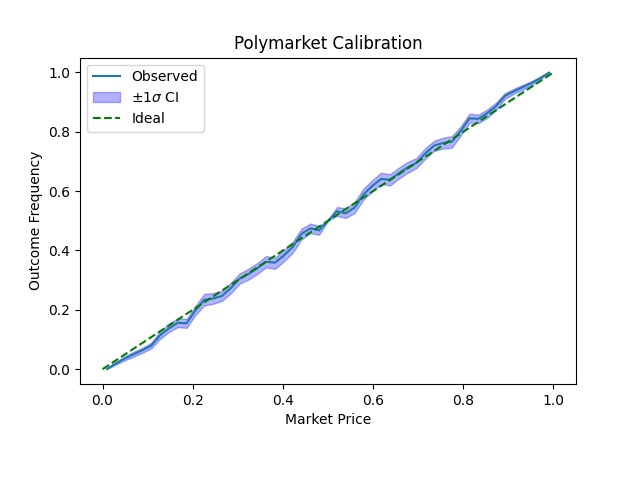
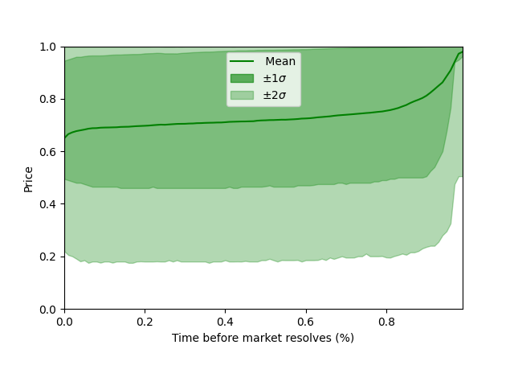
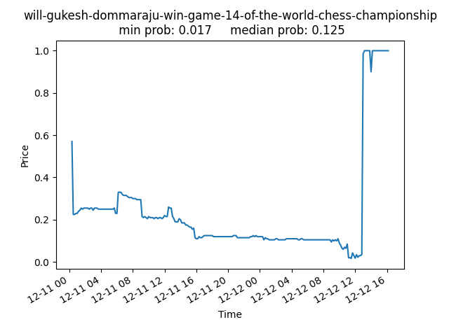

# Follymarket: Analyzing Polymarket's Successes and Failures
This repo contains python-based tools to analyze Polymarkets's prediction ability.
In `scraper.py`, market and price data are fetched from Polymarket's historical "gamma" API.
In `analyze.py`, several metrics and plots are computed, including the decomposed Brier score and calibration. Per-market metrics can be weighted by inverse-market duration. Errors for calibration plots can be computed through a quantile bootstrap.

**Read the post at [https://nickhaubri.ch/blog/follymarket-polymarket-forecast-assessment](https://nickhaubri.ch/blog/follymarket-polymarket-forecast-assessment)**

# Sample Plots

